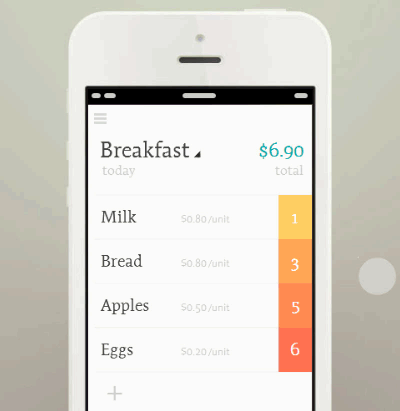

# Tally App 
## 交互式记账清单
> 技术栈：Vue  |  Vue Router  |  Vuex  |  Stylus 

这个项目缘起于曾经用 Axure 设计的一个交互原型 ：）

### 演示
  
### Online Demo 
Scan QRCode to explore the demo<br>
请用手机扫描二维码查看<br>
  
<br>
## 应用设计
* SPA 单页面应用
* 路由页面
  * 主页目录
  * 清单详情页
* 移动端响应式布局

## 功能特性
#### 主页<br>
* 新增清单
* 进入清单<br>
#### 清单详情页<br>
* 新增条目
* 点击编辑 / 删除条目
* 条目滑动交互
  * 左滑条目添加数量
  * 右滑条目数量清零
  * 颜色随数量变化而变化
* 菜单
  * 重命名该清单
  * 删除该清单
#### 其他
* 面板出现时，其内的input框自动获取焦点
* 添加动画效果

#### 浏览器打开  
* 键盘取消后恢复页面滚动位置 
* 点击输入框页面不自动放大
* 阻止浏览器默认下拉


<br>

## 安装
```
npm install
```

### Compiles and hot-reloads for development
```
npm run serve
```
